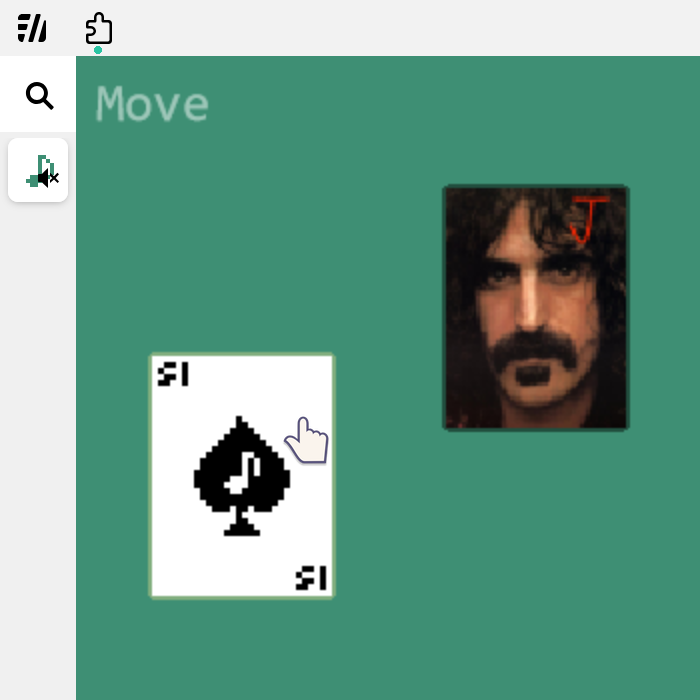
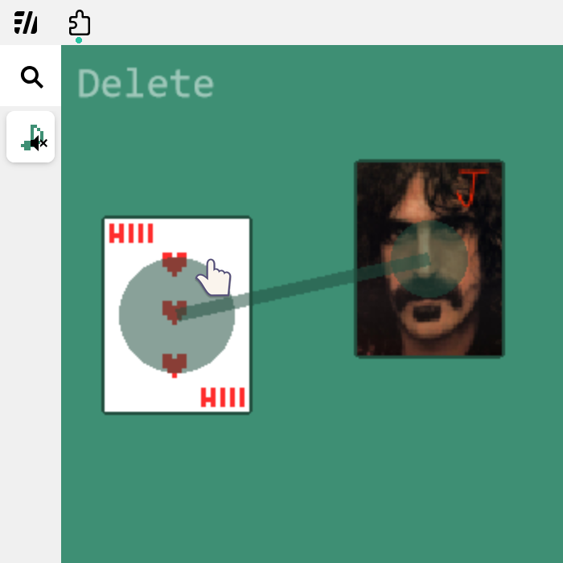
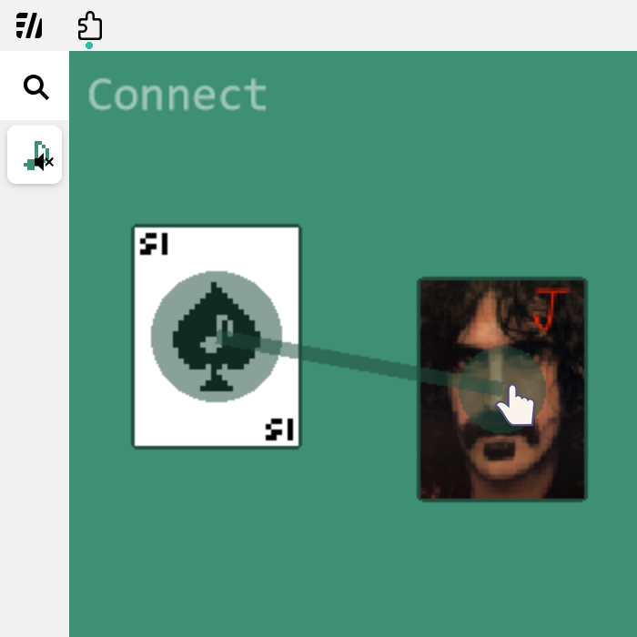

# Trump Card Synth

This documentation is about the 20240315 Jihun Park and 20240721 Sihyeon Ju's final project for CTP431 (Fall 2024.)

[Source Code (GitHub)](https://github.com/newLivesock/TRUMP_CTP431_final)

<video controls style="width: 100%; margin-bottom: 2em">
  <source src="demo.mp4" type="video/mp4">
</video>

## Running the Project

After cloning the repo, one can start a local web server in the `WEB` directory. Example of running the project is provided below.

```
git clone https://github.com/newLivesock/TRUMP_CTP431_final.git
cd TRUMP_CTP431_final/WEB
python3 -m http.server
```

Note that WebChucK might take some time (~ 40s) to initialize. We can know that WebChucK is prepared when the top left indicator is gone.

---

## Adding a New Card

To add a new card, one should press the `n` key. Then, one can enter the desired card's value and suit (e.g. "3 of hearts") into the prompt.

## Edit Modes

This project provides various modes to help editing card placements and connections. Each mode can be accessed by pressing the `m`, `x`, `c` keys respectively. 

### 1. Move [m]
- The default mode, drag and drop cards to organize or reposition them for convenience.

{:style="width:50%"}

### 2. Delete [x]
- Select the cards you wish to remove. Lines connected to these cards will be deleted automatically.

{:style="width:50%"}

### 3. Connect [c]
- Select the input cards and output cards to create or remove connections.

{:style="width:50%"}

## Note On Connecting
- It is currently **not possible** to connect from multiple cards into a single card, except for the case where the output card is the Joker.
- Closed loops and self-connections are allowed but will not produce any sound.

---

## Audio Generation

### Corresponding Waveforms for Each Suits
- **Diamond**: Square wave
- **Spade**: Triangle wave
- **Heart**: Sawtooth wave
- **Clover**: Sine wave

### Roles of Each Card

#### 1. Root Tone Deciding Card
- Cards directly connected to the Joker will decide root tones.
- Generates the nth note in the tet scale.
- The waveform is determined by the card’s suit.

#### 2. Modulating Card
- Cards connected to the 'root tone deciding cards' will modulate those.
- Produces a modulation wave as input.
- Generates the (n-1)th overtone of the root tone deciding card.
- The waveform is determined by the card’s suit.

#### 3. Joker Card
- Acts as an output stream (similar to `dac` in ChucK).
- Produces sounds based on the cards connected to it.

---

## Possible Improvements

### 1. Allow multiple connection to non-Joker cards
- Parsing information from the linked list structure in ChucK makes this challenging.

### 2. Add Envelope, Filter, etc.
- Enhancements such as envelopes and filters could improve the sound design and usability.

